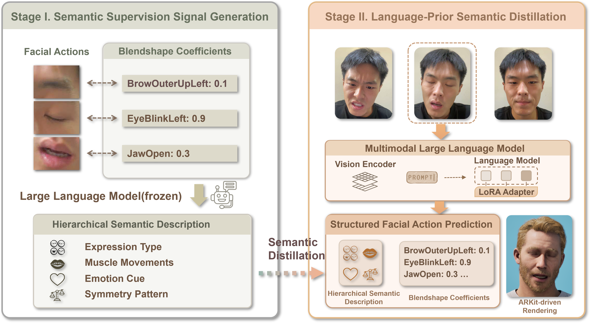

# SemanticFace: Semantic Facial Action Estimation via Semantic Distillation in Interpretable Space

<!-- [](https://github.com/kangzejian1896/SemanticFace)
[](https://arxiv.org)


[](LICENSE) -->

Official implementation of the paper:

**SemanticFace: Semantic Facial Action Estimation via Semantic Distillation in Interpretable Space**

---

# Teaser

<p align="center">
  
</p>

SemanticFace is a framework for facial action estimation in the interpretable **ARKit blendshape space**.  
Instead of directly regressing coefficients, our approach reformulates facial expression prediction as a **structured semantic reasoning problem**.

SemanticFace introduces **semantic supervision derived from ARKit blendshape parameters** and distills this knowledge into a **multimodal large language model (MLLM)**.  
This enables the model to reason about facial muscle movements and expression semantics when predicting facial actions.

The framework produces interpretable ARKit coefficients from input images while improving:

- numerical accuracy  
- perceptual consistency  
- cross-identity generalization  

---

# Demo

Below is a demo on **cartoon and stylized faces**, where we compare SemanticFace with several existing methods, including **DeadFace, SMIRK, EMOCA, and Pixel3DMM**.  
Despite the large domain gap, SemanticFace remains capable of producing stable and semantically plausible ARKit facial actions, while the other methods often fail or cannot detect faces.

 https://github.com/kangzejian1896/SemanticFace/assets/demo.mp4

<video src="assets/demo.mp4" controls width="800"></video>

---

# Method Overview

<p align="center">
  
</p>

SemanticFace adopts a **two-stage semantic distillation paradigm**.

### Stage 1 — Semantic Supervision Construction

Ground-truth ARKit coefficients are converted into structured semantic descriptions including:

- expression category  
- regional muscle movements  
- emotional implication  
- symmetry or asymmetry patterns  

### Stage 2 — Multimodal Semantic Distillation

These structured semantic descriptions are distilled into a **multimodal large language model**, enabling the model to predict ARKit coefficients from images through **semantic reasoning rather than purely numerical regression**.

---

# Installation

Clone the repository:

```bash
git clone https://github.com/kangzejian1896/SemanticFace.git
cd SemanticFace
```

Create environment:
```bash
conda create -n SemanticFace python=3.10
conda activate SemanticFace 
```

Install dependencies:
```bash
pip install 'ms-swift' -U
pip install vllm==0.13.0
pip install qwen-vl-utils==0.0.14 -i https://mirrors.westlake.edu.cn/pypi/simple
pip install modelscope
```


# Model Download

We provide pretrained SemanticFace models via ModelScope.

Download the model:
```bash
modelscope download --model kangzejian/SemanticFace --local_dir ./adapters
```
The model will be saved to:
./adapters

# Inference

Run inference using:
```bash 
sh infer.sh
```

Results will be saved to: example_result.jsonl

# Convert to CSV for Unreal Engine MetaHuman

To drive MetaHuman avatars in Unreal Engine, convert the JSON output to CSV format:
```bash 
python jsonl2csv.py
```

This converts the predicted ARKit coefficients into a format compatible with Unreal Engine MetaHuman animation pipelines.

# Visualization in Unreal Engine

The predicted ARKit coefficients can be directly used to drive MetaHuman facial animation.

Tutorial video:

https://www.bilibili.com/video/BV1Yu4y1D7SL