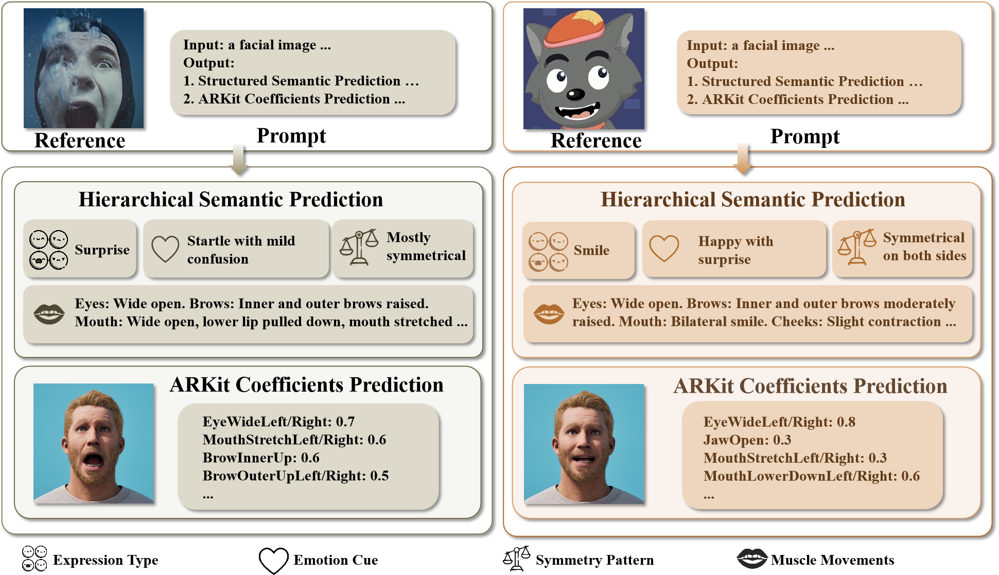

# SemanticFace: Semantic Facial Action Estimation via Semantic Distillation in Interpretable Space
<!-- 
[](https://github.com/kangzejian1896/SemanticFace)
[](https://arxiv.org) -->


[](LICENSE) 

Official implementation of the paper:

**SemanticFace: Semantic Facial Action Estimation via Semantic Distillation in Interpretable Space**

SemanticFace is a framework for facial action estimation in the interpretable **ARKit blendshape space**.  

<!-- <video src="assets/demo.mp4" controls width="800"></video> -->
<p align="center">
<a href="assets/demo.mp4">
  
</a>
</p>

Despite being trained only on real human faces, SemanticFace generalizes well to cartoon and stylized characters, producing stable and semantically plausible ARKit facial actions, while the other methods often fail or cannot detect faces.


# Method
<p align="center">
  
</p>


Instead of directly regressing coefficients, our approach reformulates facial expression prediction as a **structured semantic reasoning problem**.

SemanticFace introduces **semantic supervision derived from ARKit blendshape parameters** and distills this knowledge into a **multimodal large language model (MLLM)**.  
This enables the model to reason about facial muscle movements and expression semantics when predicting facial actions.


# Installation

Clone the repository:

```bash
git clone https://github.com/kangzejian1896/SemanticFace.git
cd SemanticFace
```

Create environment:
```bash
conda create -n SemanticFace python=3.10
conda activate SemanticFace 
```

Install dependencies:
```bash
pip install 'ms-swift' -U
pip install vllm==0.13.0
pip install qwen-vl-utils==0.0.14
pip install modelscope
```


# Model Download

We provide pretrained SemanticFace models via ModelScope.

Download the model:
```bash
modelscope download --model kangzejian/SemanticFace --local_dir ./adapters
```
The model will be saved to:
./adapters

# Inference
The experiments and demo are conducted on **1 NVIDIA A100 GPU**.
Run inference using:
```bash 
sh infer.sh
```

```markdown
> **Tip:** If you encounter OOM, change `--infer_backend vllm` to `--infer_backend pt`.  
> This reduces GPU memory usage but will be significantly slower.
```

Results will be saved to: example_result.jsonl

# Supported Hardware
The training and inference pipeline is based on MS-SWIFT.
Hardware compatibility details can be found in the official documentation:

https://swift.readthedocs.io/en/latest/GetStarted/SWIFT-installation.html

| Hardware Environment    | Remarks                                   |
| ----------------------- | ----------------------------------------- |
| A10 / A100 / H100       | Fully supported (used in our experiments) |
| RTX 20 / 30 / 40 Series | Supported                                 |
| T4 / V100               | Some models may encounter NaN issues      |
| Ascend NPU              | Some operators may be unsupported         |
| Apple MPS               | Refer to the MS-SWIFT official issue discussion|
| CPU                     | Supported but extremely slow              |


# Convert to CSV for Unreal Engine MetaHuman

To drive MetaHuman avatars in Unreal Engine, convert the JSON output to CSV format:
```bash 
python jsonl2csv.py
```

This converts the predicted ARKit coefficients into a format compatible with Unreal Engine MetaHuman animation pipelines.

# Visualization in Unreal Engine

The predicted ARKit coefficients can be directly used to drive MetaHuman facial animation.

Tutorial video:

https://www.bilibili.com/video/BV1Yu4y1D7SL
